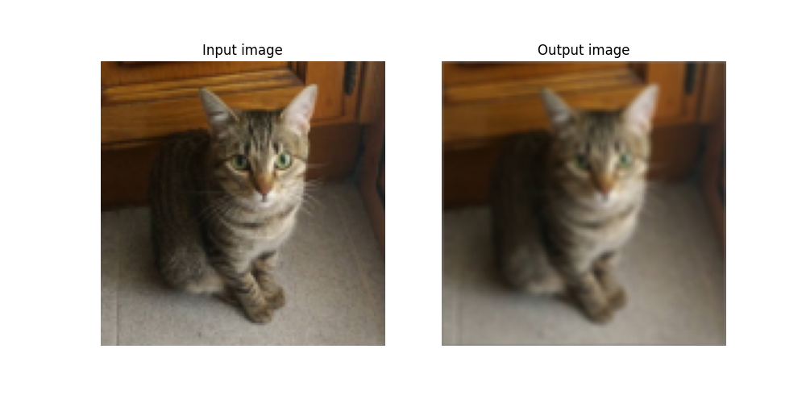

# blur_filter
A simple implementation of blur filter algorithm using kernel convolution.



## Dependencies

You can install [Matplotlib](https://matplotlib.org/stable/) using pip:

```console
$  pip install matplotlib
```

or using conda:

```console
$  conda install -c conda-forge matplotlib
```

## Usage
```console
$  python .\blur_filter.py input_image
```


